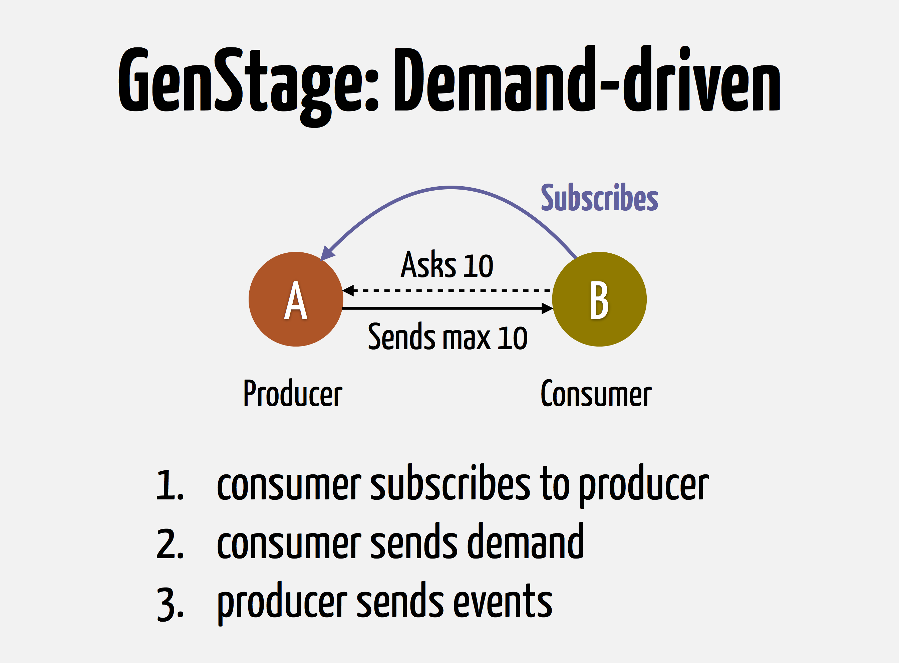

footer: Sydney Elixir Meetup, June 2016

# ElixirConfEU and Emp.ex Recap
## Josh Price / James Sadler
### @joshprice / @freshtonic

---
# ElixirConf.EU
## Berlin

---
# José Valim
## What's ahead for Elixir?

---
# What's ahead for Elixir?

- Elixir 1.3
  - getting close!
  - lots of deprecation warnings to tidy up
    - help still required
    - plenty of warnings for all

---
# with-else

Allows transform of errors

```
with :ok <- validate_strategy(strategy),
     :ok <- validate_restarts(max_restarts),
     :ok <- validate_seconds(max_seconds) do
  {:ok, state}
else
  {:error, message} ->
    {:error, String.upcase(message)}
end
```

---
# mix test --stale

---
# Mix Escripts
- Added as an alternative to archives
- Run apart from Mix
- Do not depend on the Elixir version installed locally

---
# Mix Escripts

```sh
$ mix escript.install phoenixframework.org/phoenix
$ phoenix new_app
```

---
# mix .tree

```sh
$ mix app.tree
$ mix deps.tree
```

---
# MIX_DEBUG=1 mix compile

Compiler tracing

---
# GenBroker & GenStage R&D

- Parallel Pipelines with Backpressure

---



---
# AST for fun and profit
## Rene Föhring

Credo is a learning and guidance tool

---
# ASTs for fun and profit

- readability
- software design
- refactoring opportunities
- consistency checks
- warnings

---
# ASTs for fun and profit

- ASTs are awesome
  - `quote do: 1+2`
  - `{:+, [context: Elixir, import: Kernel], [1, 2]}`

---
# Install credo

```sh
# add credo to mix.exs
$ mix deps.get
$ mix credo
```

---


---
# Scaling Distributed Erlang
## Zandra Norman

---
### Problem
#### Fully connected nodes don't work

---
# Fixing OTP 19

Issue: Connections stay up
Plan: Automatic disconnects

Issue: Too many connections
Plan: Avoid fully connected network

Issue: Expensive when new nodes join
Plan: Make node joins cheaper

Issue: :global chats a lot
Plan: Make :global less chatty

---
# Magic scaling sprinkles
## Coming soon

---
# Phoenix 1.2 and Beyond
## Chris McCord


---


---


---
# GraphQL shoutout!

## (Yay)

---
# Three Games
## Roope Kangas

- Oops! we left our MMORPG running
- For 3 months
- Never noticed
- No errors, 1000s of users

---
# Journey to 2M connections
## Garry Rennie

---
# ulimit -n 2000000

---
# Phoenix and Riak Core
## Ben Tyler

- Riak core implements Dynamo (Amazon)
- Implement riak core genserver
- Rebalance data

---


---
# Phoenix is not your app

- Build your app first
  - no HTTP interface
- Include your (micro)app(s) as deps in Phoenix

---


---
# Emp.ex
# Empire State Elixir Conf
## New York City

---
# Jazz Hands


---
# The Climb
## Experiencing the Rise of Elixir from the Inside
### Bruce Tate

---
# The Climb

- Lots of work went into Elixir
- Jose made several attempts
- Then discovered Erlang
- BOOM!
- Inspirational feel good talk
- Elixir is the future

---
# Real World Elixir Deployment
## Pete Gamache

- Using EXRM for zero downtime deployments is hard
- Lot's of war stories
- Use edeliver which makes it easier

---
# A Journey To The Center Of The BEAM
## Brian Mitchell

- Thrilling intense ride through all of the compilation steps
- I didn't understand most of this
- Explained some weird things deep in stacktraces
- Lot's of stuff happens when you compile!

---
# CodeDeploy
## Monica Hirst


---


---
# CodeDeploy Resources

http://docs.aws.amazon.com/codedeploy/latest/userguide/welcome.html

---
# Micropatterns: Learning to Reach Quickly for the Right Tool
## Cameron Price

- Forget GoF patterns they don't really make sense in FP
- Recursion! learn to use it, don't be afraid
- Practice small exercises to improve (exercism.io, etc)

---
## Concurrency + Distribution = Scalability + Availability
## a journey architecting Systems on BEAM
### Francesco Cesarini

---
# Dark Magic


---
# Dark Magic

- OTP doesn't give you Scalability and Availability for free
- Need to carefully design your system
- Lots of patterns

---
# Buy the book


---
# Resources

* ElixirConf.EU
  * http://www.elixirconf.eu/elixirconf2016
  * Talks and slides up
* Empex NYC
  * http://empex.co/
  * Talks and slides soon?

---
# `mix ecto`

- now shows ecto tasks
- https://github.com/elixir-lang/ecto/pull/1442

## Could be generalised

- `mix <string>`
- `mix help --search "<string>."`

---
# Project Idea

- `mix deps.tree --dot`
- `mix apps.tree --dot`

I'm halfway through a solution if someone wants to help out

---
# Some Other Project Ideas

---
# Improve Ecto README

- instructions could use a little work
- not as helpful for beginners as could be

---
# Dialyzer with Credo-style reports

- Problem: Dialyzer v Dialyxir
  - Funky, hard to read error messages
- Solution: Credo reports for Dialyzer
- Inspiration: Elm error messages

---
# Thanks!
