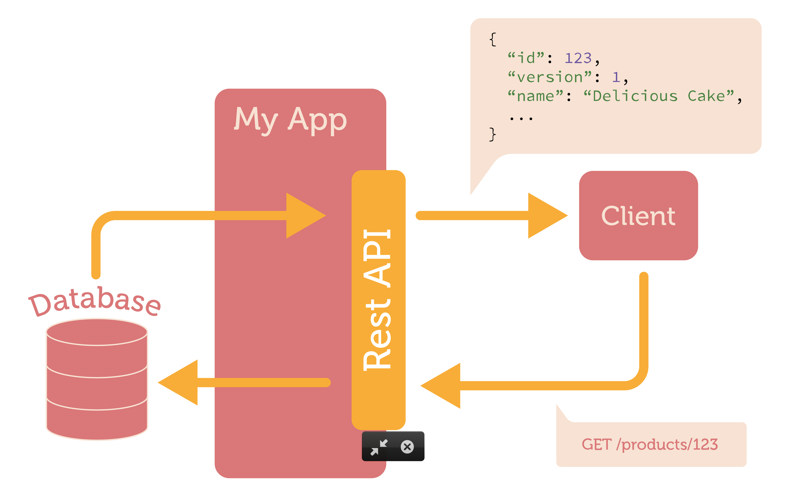
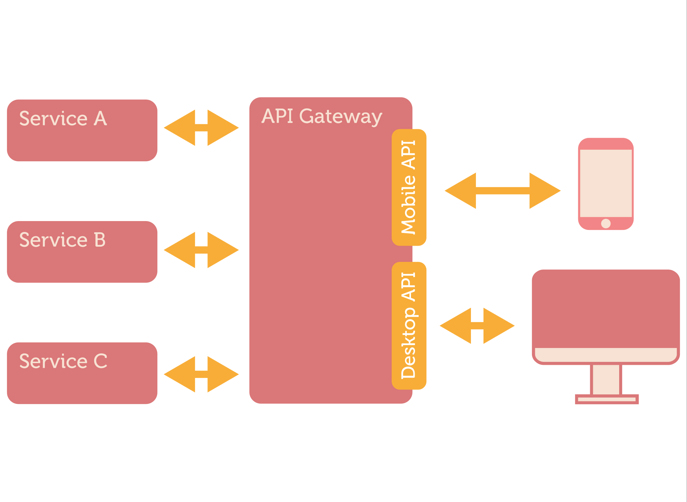
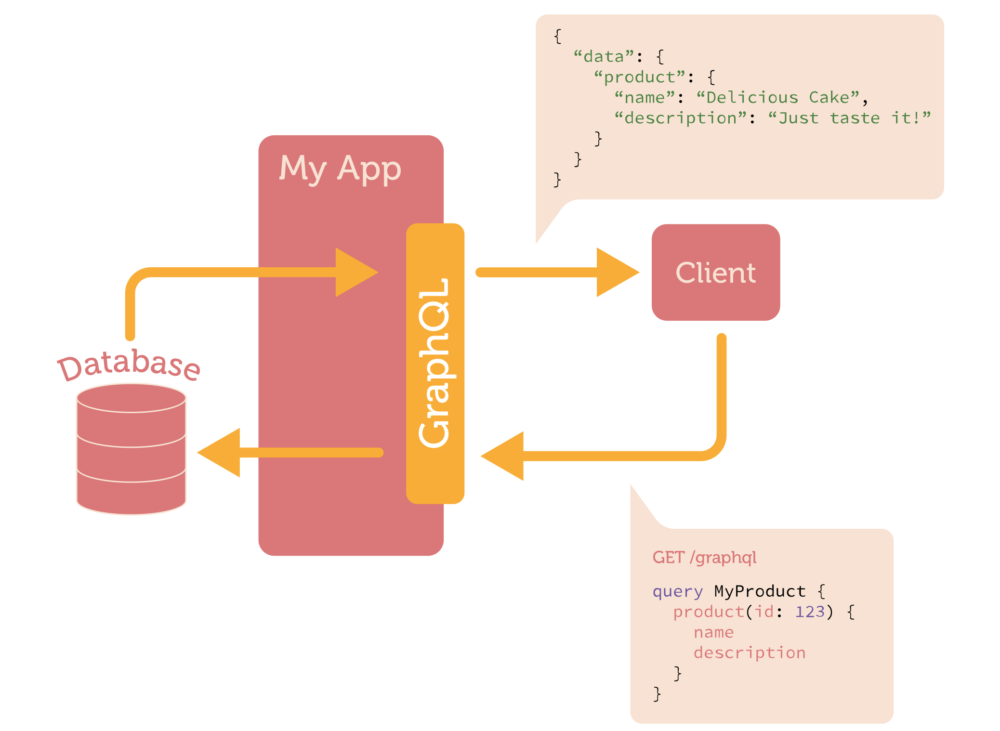

# Better APIs with GraphQL
## Josh Price
### github.com/joshprice
### @joshprice

---
# [Fit] Preview
# [Fit] Feedback
# [Fit] Welcome

---
# My Background

* Mostly Java, Ruby and consulting
* Fell in love with Elixir ~9mths ago
* Functional langs only from now on!
* Intrigued by the promise of GraphQL
* Started GraphQL Elixir as first real OSS project

---
# [Fit] REST ==
# [Fit] Cargo Cult?

^ describe what a cargo cult is
^ history and images of Tanna, Vanuatu
^ Magical Thinking

---
> Any sufficiently advanced technology is indistinguishable from magic.
-- Arthur C. Clarke

^ Clarkes 3 laws
^ Clarke's first law
^ When a distinguished but elderly scientist states that something is possible, he is almost certainly right. When he states that something is impossible, he is very probably wrong.
^ Clarke's second law
^ The only way of discovering the limits of the possible is to venture a little way past them into the impossible.
^ Clarke's third law
^ Any sufficiently advanced technology is indistinguishable from magic.

---

^ "Cargo cult science" coined by Feynman
^ The metaphorical use of "cargo cult" was popularized by physicist Richard Feynman at a 1974 Caltech commencement speech

---
# Cargo Cult Programming 

^ Coined by Steve McConnell
^ Cargo cult programming is a style of computer programming characterized by the ritual inclusion of code or program structures that serve no real purpose
^ How are cargo cult relevant?

---
# REST as Cargo Cult?

* Designed like the web for loose coupling
* But internally we tend to have tightly coupled clients to our APIs
* Externally it's a different story, REST works well for that

---
# REST is great

* Simple HTTP transport (request/response)
* ? Readable data representation (JSON vs XML)
* ? Resource oriented and easy to model
* URL based (easy to develop against/debug)
* APIs work like the web does
* Lot's of tooling for free

---
# REST is *hard* in practice

* Big upfront design required
* Impossible to get right
* Hard to change (versioning problems)
* Maintainability issues
* No one true way to do REST
  - Swagger and OpenAPI trying to standardise
* Poor performance (N+1 resource traversals)
  - fetch user, then fetch friends, then fetch pets

^ Need to anticipate all current and future clients and their needs
^ Badly designed APIs can significantly hamper the design of great frontends

---


---


---


---
# Exhibit A: REST API

`GET /users/1/friends?include=user.name,friend.name`

^ This is what GraphQL provides for you is a standard way of doing this

---
# Exhibit B: GraphQL API

```
POST {                                "data": {
  user(id: 1) {                         "user": {
    name                                  "name": "Josh",
    friends {                             "friends": [{
      name                                  "name": "Vignesh"
    }                                     }]  
  }                                     }  
}                                     }
```

---
# What is GraphQL?

* Language for defining types & queries
* Developed by Facebook
* Used internally since 2012
* Open source version published in July 2015
* Relay released in August 2015
* Specification: https://facebook.github.io/graphql

---
# GraphQL highlights

* It's a *specification* for client/server interaction
* Language independent
* Assumes nothing about:
  - transport, message protocol, data store

---
# Key features

* Single API endpoint / URL
* Strongly typed
* Queries are declarative fetch only required data
* They have the same shape as the response
* Queries can provide all data required by view in single query
* Self documenting

---
# Why use GraphQL?

* Declare your data and fetching functions
* Clients fetch exactly the data they need in a single call
* Call a single API endpoint with docs and tooling
* Major bandwidth/latency reduction from overfetching and N+1 calls

---
# Simple Schema

```elixir
%Schema{
  query: %ObjectType{
    name: "SimpleQuery",
    fields: %{
      greeting: %{
        type: %String{},
        resolve: fn (_, _, _) -> "Hello, world!" end
      }
    }
  }
}
```

---
# Simple Query

### Query

```js
{ greeting }
```

### JSON response

```js
{
  "data": {
    "greeting": "Hello, World!"
  }
}
```

---
# Schema with Data Fetching

```elixir
@items %{"a" => %{id: "a", name: "Foo"}, "b" => %{id: "b", name: "Bar"}}

%Schema{
  query: %ObjectType{
    fields: %{
      item: %{
        type: %Item{},
        args: %{id: %{type: %String{}}},
        resolve: fn(_, %{id: id}, _) -> Map.get(@items, id) end
      }
    }
  }
}
```

---
# Query

```js
{
  item(id: "a") {
    id
    name
  }
}
```

---
# JSON Response

```js
{
  "data": {
    "id": "a",
    "name": "Foo"
  }
}
```

---
# Setup GraphQL with Phoenix

Installing in Phoenix or Cowboy is really simple:

```
forward "/", GraphQL.Plug, schema: {TestSchema, :schema}
```

---
# GraphQL Elixir

* Community driven Elixir GraphQL implementation
* Ported from JS reference implementation
* Getting close to spec completeness (1.0 coming soon)
* 20+ contributors
* 9 team members

---
# Ecosystem

* Thriving ecosystem of tools
  - **graphql** (core)
  - **plug_graphql** (mount in Phoenix or Cowboy)
  - **3 Parsers** (Vignesh's NIF wrapper)
  - **Phoenix** examples
  - **Relay** support (TodoMVC example)
  - **EctoGraph** (generate GraphQL types from Ecto models)
  - **RethinkDB** examples

---
# Future 

* HTTP/2
* Push is the Future
  - Google docs
  - Each web application should reflect current state at all times
* Subscriptions + Phoenix channels + RethinkDB
* Elm, Ember, etc...

---
# How can you get involved?

* Try it out
* Ask questions in Slack
* Tweet about it
* Star the repos
* Report a bug
* Fix a bug
* Contribute: PRs, tools, website, documentation, blog, just ask!

---
# Resources

* Website
  - http://graphql-elixir.org
* Plug (Hex: plug_graphql)
  - https://github.com/graphql-elixir/plug_graphql
* Examples
  - https://github.com/graphql-elixir/hello_phoenix_graphql


---
# Questions?
