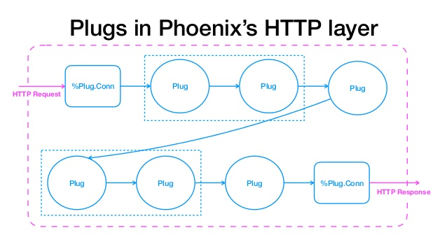

footer: © Josh Price, 2018

# Elixir Plugs
## Josh Price
### @joshprice
---
```elixir
defmodule MyAppWeb.Router do
  use Phoenix.Router

  pipeline :browser do
    plug :fetch_session
    plug :accepts, ["html"]
  end

  scope "/" do
    pipe_through :browser

    get "/", PageController, :index
  end
end
```
---
# What is a Plug?
---
# Really Simple
## But Hard to Explain
---
## A way to represent
# Web (or HTTP)
## Requests & Responses
---
## Easy to
# "plug"
## together
---
## Let's Phoenix
## Talk to Cowboy
## (The Erlang Webserver)
---
## *Phoenix* is based heavily on Plugs
---
## Everything is a Plug
### (Almost)
---



---
# Phoenix Endpoint

- Where Phoenix starts handling the request
- The Endpoint Plug calls the Router Plug
- After it has done some pre-processing

---
# Pipelines

```elixir
pipeline :browser do
  plug :fetch_session
  plug :accepts, ["html"]
end
```

- Pipeline calls each Plug in order
- Pipelines are themselves a Plug

---
# Plugs are everywhere in Phoenix

- Endpoint
- Router
- Pipeline
- Controller Actions

---
# What does Phoenix do then?

- Gives you conventions and structure
- Easy to glue Plugs together
- Channels absctraction
- Some generators
- Templating
- Not much else really

---
# What is `Plug.Conn`?

```elixir
%Plug.Conn{
  host: "localhost",
  port: 4000,
  path_info: ["posts", "1"],

  # ... lots of other fields ...
}
```

---
# What is `Plug.Conn`?

- Direct connection to underlying webserver
- Holds all header, request and response info
- Passed all the way through the plug pipeline

---


---
# All the Things!

```elixir
iex(1)> %Plug.Conn{}
%Plug.Conn{adapter: {Plug.Conn, :...}, assigns: %{}, before_send: [],
 body_params: %Plug.Conn.Unfetched{aspect: :body_params},
 cookies: %Plug.Conn.Unfetched{aspect: :cookies}, halted: false,
 host: "www.example.com", method: "GET", owner: nil,
 params: %Plug.Conn.Unfetched{aspect: :params}, path_info: [], peer: nil,
 port: 0, private: %{},
 query_params: %Plug.Conn.Unfetched{aspect: :query_params}, query_string: "",
 remote_ip: nil, req_cookies: %Plug.Conn.Unfetched{aspect: :cookies},
 req_headers: [], request_path: "", resp_body: nil, resp_cookies: %{},
 resp_headers: [{"cache-control", "max-age=0, private, must-revalidate"}],
 scheme: :http, script_name: [], secret_key_base: nil, state: :unset,
 status: nil}
```

---
# Slightly neater view of some Things

```elixir
iex(1)> %Plug.Conn{}
%Plug.Conn{
  halted: false,
  host: "www.example.com",
  method: "GET",
  params: %Plug.Conn.Unfetched{aspect: :params},
  port: 0,
  query_params: %Plug.Conn.Unfetched{aspect: :query_params},
  query_string: "",
  req_headers: [],
  request_path: "",
  resp_body: nil,
  resp_headers: [{"cache-control", "max-age=0, private, must-revalidate"}],
  scheme: :http
  status: nil}
```

---
# 2 types

* Function
* Module

---
# Function Plug

* any function
* takes `conn`ection + options
* returns a `conn`ection

```elixir
def my_plug(conn, _opts) do
  conn |> do_something_to_conn
end
```

---
# Function Plug Hello World

```elixir
    def hello_world_plug(conn, _opts) do
      conn |> Plug.send_resp(200, "Hello world")
    end
```

---
# Module plug

* `init(options)` initialises options
* `call(conn, options)` same as a function plug

The result of `init/1` is passed to `call/2`

`init/1` may be called during compilation

---
## Module Responder
```elixir
    defmodule MyPlug do

      @behaviour Plug

      def init(options) do
        options
      end

      def call(conn, _opts) do
        conn
        |> put_resp_content_type("text/plain")
        |> send_resp(200, "Hello world")
      end
    end
```

---
# Pipeline example
```elixir
    defmodule MyPlugPipeline do
      use Plug.Builder

      plug Plug.Logger
      plug :hello, upper: true

      # A function from another module can be plugged too, provided it's
      # imported into the current module first.
      import AnotherModule, only: [interesting_plug: 2]
      plug :interesting_plug

      def hello(conn, opts) do
        body = if opts[:upper], do: "WORLD", else: "world"
        send_resp(conn, 200, body)
      end
    end
```
