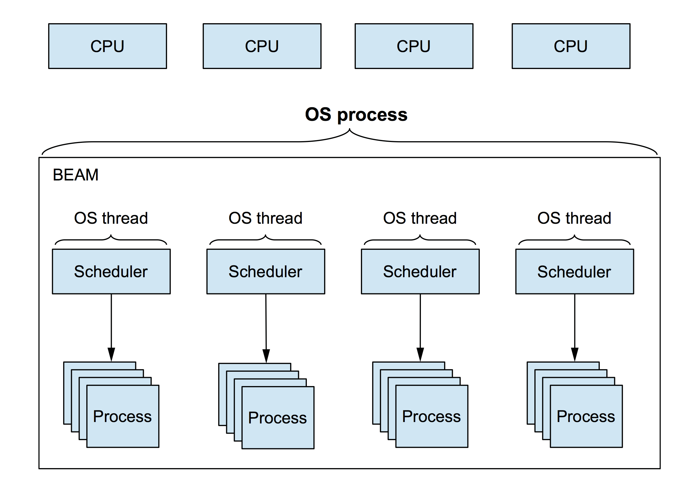

  ## Intro to Processes
## and the Actor Model
### Josh Price
### @joshprice

---
# Erlang / Elixir

- Functional
- Concurrent
- Distributed
- Fault tolerant
- Design and build highly available systems

---
# Principles of Highly Available Systems

1. Fault Tolerance
  - Minimise, isolate and recover from errors
2. Scalability
  - Handle load without redeploying
3. Distributed
  - Run across multiple redundant machines

---
# BEAM (Erlang VM)

- "**B**ogdan's/Björn's **E**rlang **A**bstract **M**achine"
- Runs in a single OS process
- Has its own scheduler
  - 1 per CPU core
- Each scheduler runs in its own OS thread

---
# BEAM



---
# What is a Beam Process?

- Process is a concurrent thread of execution
- The **fundamental unit of concurrency**
- **Lightweight** (up to 268m)
- Independent of OS processes
  - BEAM process != OS Process
- Fast startup ~1μs, 1-2Kb RAM
- No shared memory

---
# Sound familiar?

###  Let's hear what
### [fit] Alan Kay
### has to say about it

---
> I invented the term Object Oriented, C++ wasn't what I had in mind

---
> I'm sorry I coined the term Objects... The big idea is messaging

---
> I thought of objects being like biological cells or computers on a network

---
# OOP to Alan Kay means only

- Messaging
- Local retention and protection
- Hiding of state-process
- (Extreme late-binding of all things)

---
# Processes as Objects?

- Arguably more OO
  - messaging
  - isolation (memory and error)
  - encapsulation of state
  - location transparency (local/remote)

---
# Create a Process

```elixir
spawn(fn ->
  :timer.sleep(2000)
  IO.puts "Done!"
end)

iex(1)> spawn(fn -> :timer.sleep(2000); IO.puts("Done!") end)

#PID<0.68.0>

Done!
```

- Note: **pid** is the **Process ID**
- You need a **pid** to send messages to processes

---
# Anatomy of a PID

Printed Process IDs are in the from **\<A.B.C\>**:

A. the node number (0 is the local node, arbitrary number for a remote node)
B. the first 15 bits of the process number
C. bits 16-18 of the process number (the same process number as B)

- because old Erlang release reasons

---
# Cross Process Data Passing

```elixir
iex(2)> async_query = fn(name) ->
  spawn(fn ->
    :timer.sleep(2000)
    IO.puts "Done: #{name}!"
  end)
end

iex(3)> async_query.("Query 1")
#PID<0.76.0>
Done: Query 1!
```

- `name` passed via closure to inner lambda
- **Data is deep-copied** when passed across processes

---
# Registered Processes

- You can give singleton processes a nice name

```elixir
Process.register(pid, :process_name)
```

- Local alias only (can't be used across BEAM instances)
- Single alias per process
- Single process per alias

---
# Message Passing

- Two message types: Casts and Calls
- **Casts** are asynchronous messages
  - "Fire and Forget"
- **Calls** are Synchronous messages
  - request/response
  - caller waits until response arrives
  - are built using casts under the covers

---
# Mailboxes

- Messages arrive in process mailbox
- Processed in order of arrival (FIFO queue)
- Processed synchronously
  - New message is not processed until old is done
- Only pattern matched messages are removed from queue
- Gotcha: Mailbox size is unbounded so you need a catchall

---
# Actor Model?

- First described by Carl Hewitt
- Erlang is an **accidental** implementation of the Actor Model
- Erlang implementors came up with this independently
- Actor isn't used too much in Erlang community

---
# Actor Model

- Each actor is a process
- Each process performs a specific task
- Send (async) messages to processes to do work
- Response is sent back as another async message
- Handled messages are pattern matched
- Share nothing (with other processes)

---
# Questions?

---
# Thanks!
