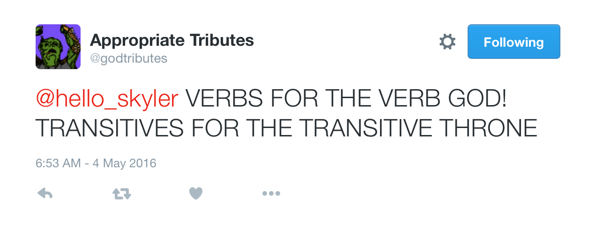
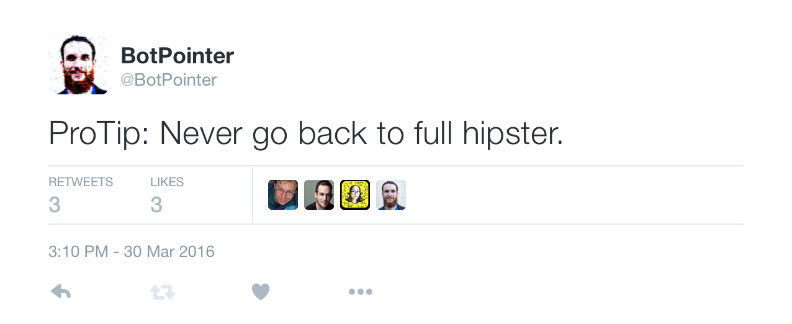
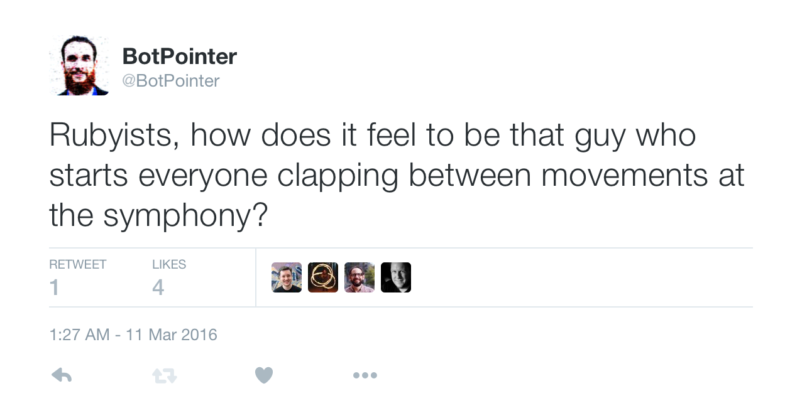
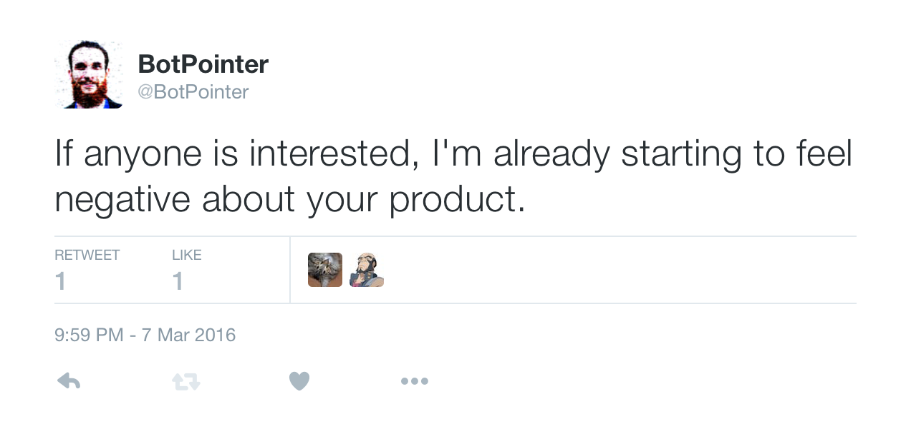
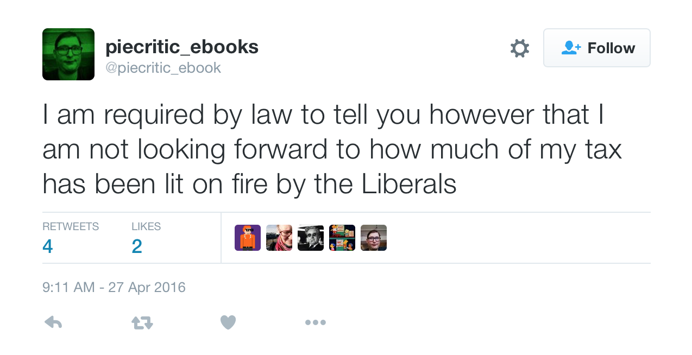
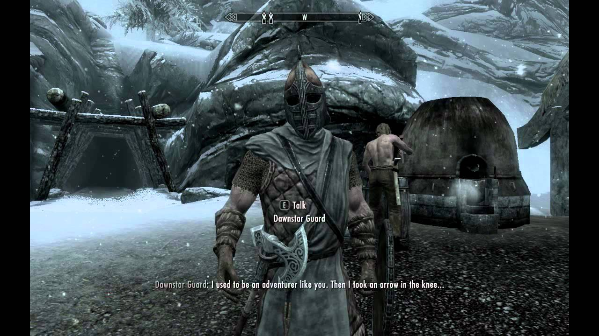
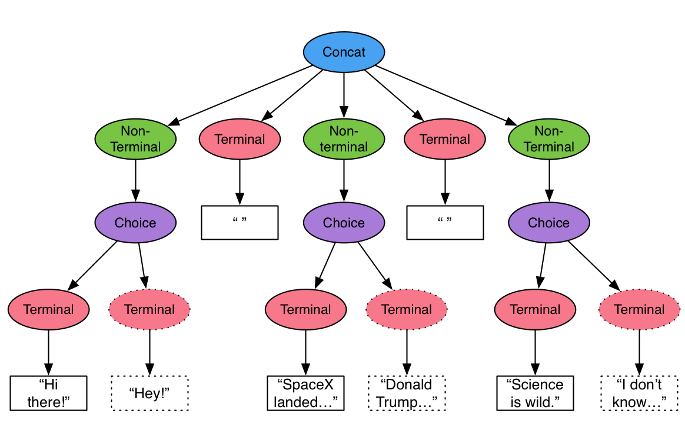
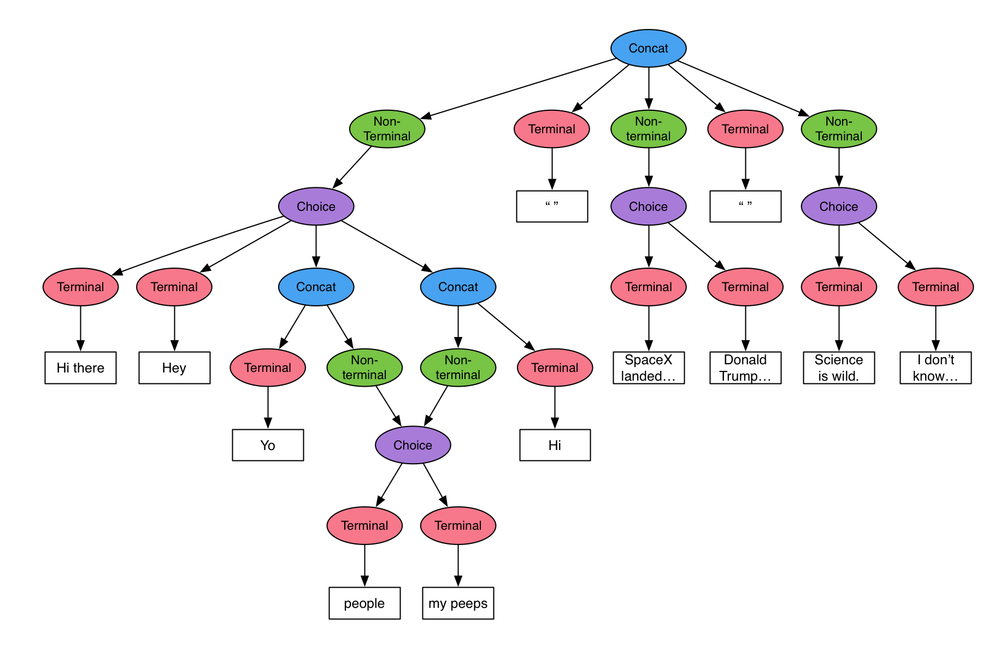

# [fit] Voxpop
## [fit] Generative grammars in Elixir

---

# Let's talk about text.

^ Let's talk about text. It turns out that language is complicated. Saying things is hard. I fail at it every day. It's hard for us -- It's much harder for computers

^ Everyone is very gung-ho about chat bots right now. Chat bots to order your uber, chat bots to order your pizza, chat bots to book that meeting you don't want to go to anyway.

^ And then there are twitter bots. They are glorious creatures.

---



^ This is the appropriates bot, one of my favourites.

^ It's actually kind of sophisticated. It pulls the nouns from your tweet and transforms them into an utterance in this template.

^ What's really cool is it's now not just analysing your text for nouns, but also your images.

---


^ Some of you might know BotPointer. He's an ebooks bot, which means I used a ruby package.

^ BotPointer's "intellegence" comes from a markov chain built from my tweets.

^ I am sometimes mystified by the tweets which are produced.

---



^ Some are useful tips

---


^ Some make me worry about the state of my bank account

---



^ Sometimes they are full of snark and it makes me so proud...

---


^ Sometimes it can be very philosophical.

---



^ In the end, because it's drawn from my tweets, it's a mirror and sometimes it reminds me what I tweet like.

^ I guess it's a bit narcissistic: being fascinated by your reflection...

---


^ Of course there are ebooks bots of other people, including some of our own number. The work of piecritic_ebooks is particularly sterling.

---

## [fit]Garbage in,
## [fit]Garbage out.


^ And I could hardly talk about twitter bots without talking about one of the most famous twitter bots: Tay

^ I couldn't find an appropriate tweet which really captured how off the rails this bot went, but it shows the perious path of training a bot using the unfiltered spewings of the masses.

---
# Okay. If not twitter or chat then where?

^ So that's a lot of talk about useless twitter bots, what on earth does have that to do with anything?

^ Well, twitter bots are fun but ultimately useless and sometimes scary, but there are actual use cases for generative text.

^ We encounter text all the time through apps, and just adding a little bit of character makes it nice, but character gets old.

---



^ Sometimes what is fun once, gets old when it is repeated

^ This is one of the better cases for generative text. In games where you don't have all your dialogue pre-recorded, some novelty can increase the replayability of the game.

^ For those of you who are not familiar with this particular example, it's a piece of gaming lore from a Bethesda title: skyrim. The non-player characters around the villages in this massive world don't have many utterances, and this one gets repeated so much it has become its own meme.
 
---

# [fit]Unguided text generation == bad.

^ From our twitter bot examples, I'm confident that I'm not going to be able to create something that unguided writes the right thing for a given context.

^ However it doesn't seem so unrealistic to be able to create a larger set of utterances for a given context from a template.

^ It would increase the diversity of utterences available to us, without having to write them all ourselves, reducing the liklihood of a "arrow to the knee" situation.

---

# Templates

^ So what would one of these templates look like?

^ Let's write a grammar for conversation starting small talk.

---

# small talk, not Smalltalk™

`{greeting} {observation} {opinion}`

> "Hey there! SpaceX finally landed the Falcon 9 first stage on the floating barge. Science is incredible."

^ There are obvious issues with this grammar. It's not totall general, but it's going to get us a long way.

---

# Greetings

```Elixir
rule :greeting, [ 
    "Did you hear?",
    "Good news everbody!",
    "O. M. G.",
    "Have you heard?",
    "Fresh from the newswire:"
    ]
```

^ We can add some more greetings. They're kind of simple, but even if we're splitting the greeting we're looking at 9 unique utterences

---

# Observations

```Elixir
rule, :observation, [
    "SpaceX finally landed the Falcon 9 first stage on the floating barge.",
    "Ecto 2 looks like it will bring a lot of improvements.",
    "The Giro D'Italia starts on Friday.",
    "A sportsball team had an unlikely victory this week.",
    "The hex website has had a nice update.",
    "It turns out the internet will ruin everything.",
    "Donald Trump has a non-zero chance of becoming president",
]
```

^ Okay these are a bit small, but there's 7 variations, which means we have 63 utterences when combined with our greetings

---

# Opinions

```Elixir

rule :opinion, [
    "Science is wild.",
    "This is the final portent of the end times.",
    "There's never been a more exciting time to be a chatbot.",
    "I don't know what to do with myself.",
    "I'm as surprised as you are."
]

```

^ And now having 6 more of those, we're up to 378 utterances.

^ This ruleset is pretty coarse, so those big chunks of text will be obvious when they repeat, but you get the idea.

---

# Surprise

^ Those who are paying attention will have noticed that these lists look a bit like code.

^ They are! They're in the Voxpop DSL!

---

# DSLicious

```elixir

defmodule Smalltalk.Starter do
  use Voxpop.Grammar
  
  start "{greeting} {observation} {opinion}"

  rule :greeting, [ 
    "Did you hear?",
    "Good news everbody!",
    "O. M. G.",
    "Have you heard?",
    "Fresh from the newswire:"
    ]
  
  rule :observation, [
      "SpaceX finally landed the Falcon 9 first stage on the floating barge.",
      "Ecto 2 looks like it will bring a lot of improvements.",
      "The Giro D'Italia starts on Friday.",
      "A sportsball team had an unlikely victory this week.",
      "The hex website has had a nice update.",
      "It turns out the internet will ruin everything.",
      "Donald Trump has a non-zero chance of becoming president.",
  ]
  rule :opinion, [
      "Science is wild.",
      "This is the final portent of the end times.",
      "There's never been a more exciting time to be a chatbot.",
      "I don't know what to do with myself.",
      "I'm as surprised as you are.",
      "I don't want to live anymore."
  ]
end

```

---

# Holy AST Batman



^ This is effectively what is generated by this grammar. It's fairly simple and due to the lack of diversity, things still feel a bit stale

---

"Fresh from the newswire: SpaceX finally landed the Falcon 9 first stage on the floating barge. I'm as surprised as you are."

---
"Did you hear? The hex website has had a nice update. There's never been a more exciting time to be a chatbot."

---
"Did you hear? Ecto 2 looks like it will bring a lot of improvements. This is the final portent of the end times."

---
"O. M. G. The hex website has had a nice update. I'm as surprised as you are."

---
# Moar options!



^ This one is a bit more complex and it's starting to feel a lot better. 

---

# Moar options!

```Elixir
  rule :greeting, [
    "Did you hear?",
    "Good news {people}!",
    "Yo {people}!",
    "Wake up {people}!",
    "Have you heard?",
    "Fresh from the newswire:"
  ]

```

^ What we've done here is added some concat options into the mix. It means we can cheaply get some more options which multiply out.

---

# Moar options!

```Elixir
  rule :people, [
    "comrades",
    "friends",
    "team",
    "humans",
    "my peeps",
    "good people"
  ]
```

^ So here's the rule for people. Another 6 variations, which are applied to three of the parent rules.

^ It's getting a bit hard to reason around, and that's good in some ways. I've found the harder it is to draw, the better it's going to be.

---

"Fresh from the newswire: The hex website has had a nice update. This is unprecedented."

---

"Wake up comrades! The hex website has had a nice update. Wowzers."

---

"Wake up friends! The Giro D'Italia starts on Friday. There's never been a more exciting time to be a chatbot."

---
# [fit] Ported from Ruby

## [github.com/maetl/calyx](https://github.com/maetl/calyx)

^ So all of this -- even this talk is ported from work done by Mark Rickerby. He's actually working towards generating a novel which obviously requires a much more sophisticated grammar.


---

# [fit] Now for some Elixir
## [github.com/zova/voxpop](https://github.com/zova/voxpop)

^ This is all up on the githubs now. You can come and work on it with me if you want.

^ Let's p

---

# Production


```elixir
defprotocol Voxpop.Production do
  def evaluate(production, registry)
end

```

---

# Terminal


```elixir
defmodule Voxpop.Terminal do
  defstruct atom: ""

  defimpl Voxpop.Production do
    def evaluate(terminal, _registry) do
      terminal.atom
    end
  end
end
```

---

# Non-Terminal

```elixir
defmodule Voxpop.NonTerminal do
  defstruct :rule
end

defimpl Voxpop.Production, for: Voxpop.NonTerminal do
  def evaluate(non_terminal, registry) do
    registry.rules
    |> Map.get(non_terminal.rule)
    |> Voxpop.Production.evaluate(registry)
  end
end
```

---

# Concat

```elixir
defmodule Voxpop.Concat do
  defstruct parts: []

  def parse(rule, matches) do
    %Voxpop.Concat{parts: do_parse(rule, List.flatten(matches), 0)}
  end

  defp do_parse(rule, [], offset) do
    [wrap_text(binary_part(rule, offset, byte_size(rule) - offset))]
  end

  defp do_parse(rule, [{pos, length} | matches], offset) do
    keep = pos - offset
    new_offset = pos + length

    << _ :: binary-size(offset), part::binary-size(keep), token::binary-size(length), _::binary>> = rule
    [wrap_text(part) | [extract_key(token) | do_parse(rule, matches, new_offset)]]
  end

```

(contd.)

---

# Concat

```elixir
  defp extract_key(token) do
    key = token |> String.slice(1..-2) |> String.to_atom
    %Voxpop.NonTerminal{rule: key}
  end

  defp wrap_text(part) do
    %Voxpop.Terminal{atom: part}
  end
end

defimpl Voxpop.Production, for: Voxpop.Concat do
  def evaluate(concat, registry) do
    concat.parts |> Enum.map(&Voxpop.Production.evaluate(&1, registry)) |> Enum.join
  end
end

```
---

# What now?

---

# Weighted Choice

## [fit] A choice which is skewed towards particular options

```elixir
rule :feeling,[
    awful: 0.15
    bad: 0.2
    okay: 0.4
    good: 0.2
    great: 0.15

]

```

---

# Context

## [fit] Injecting runtime data into a pre-generated grammar definition

```elixir
MyGrammar.generate(%{
  name: "Andrew", 
  preferred_greeting: "Hello {name}"
})
```

---
# Transforms

## [fit] Run functions on evaluated strings

```elixir
start "{greeting|captialize}, {noun|pluralize}"
```

---
# Per Generation Repetition Avoidance
## If a choice rule is used twice in a generate, avoid repeating the same choice

```elixir
"What a {positive_word} day today! Aren't you feeling {positive_word}?"
```

---
# Inter Generation Repetition Avoidance
## The same as above, but avoid repeating yourself across generations

*¯\_(ツ)_/¯*

---
# API design by shouting!

---
# [fit] Questions?

## [fit] I have been @mootpointer
