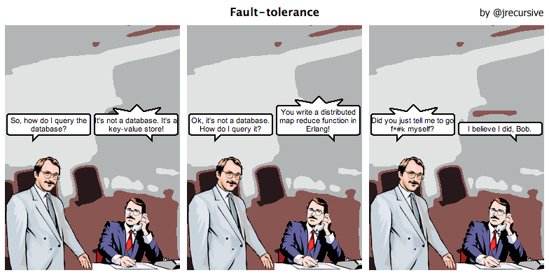

# PG2 on AWS

---

# [fit] You might remember...
### *Once upon a time I managed to get a Phoenix app deployed on AWS*

---

# But...

### It's not much use if they can't talk to each other

---
# The Dream


---
### Or maybe just some nice Phoenix Channels 

---

# What to do?

 - Find the other hosts on launch
 - Make sure the right ports are open
 - Make sure we're listening on the right ports
 - ???
 - Profit!
 
---
# Find the other hosts
## AfterInstall Hook

```sh
!# /bin/sh
APP_NAME=workoutomatic
REGION=$(curl http://169.254.169.254/latest/meta-data/placement/availability-zone | head -c-1)
aws ec2 describe-instances \
  --query 'Reservations[].Instances[].NetworkInterfaces[].PrivateIpAddresses[].PrivateDnsName' \
  --output text \
  --region ${REGION}\
  --filter Name=tag:app,Values=${APP_NAME} | \
    sed '$!N;s/\t/\n/' | \
    sed -e "s/\(.*\)/'\1'./" > /var/www/workoutomatic/.hosts.erlang

sed -r -i "s/\-sname.+/\-name api\@$(hostname -f)/g" \
  /var/www/workoutomatic/running-config/vm.args

```

---
# Open the ports

## *4369, 9000-9100*

---

# Make sure we're listening

```
    "max_port": [
      datatype: :integer,
      doc: "inet_dist_listen_max kernel option",
      default: 9100,
      hidden: false,
      to: "kernel.inet_dist_listen_max"
    ],
    "min_port": [
      datatype: :integer,
      doc: "inet_dist_listen_min kernel option",
      default: 9000,
      hidden: false,
      to: "kernel.inet_dist_listen_min"
    ],

```
---

#???

---

# Demo Time!

---

# Lolnope

---

# Questions
## *@mootpointer*
