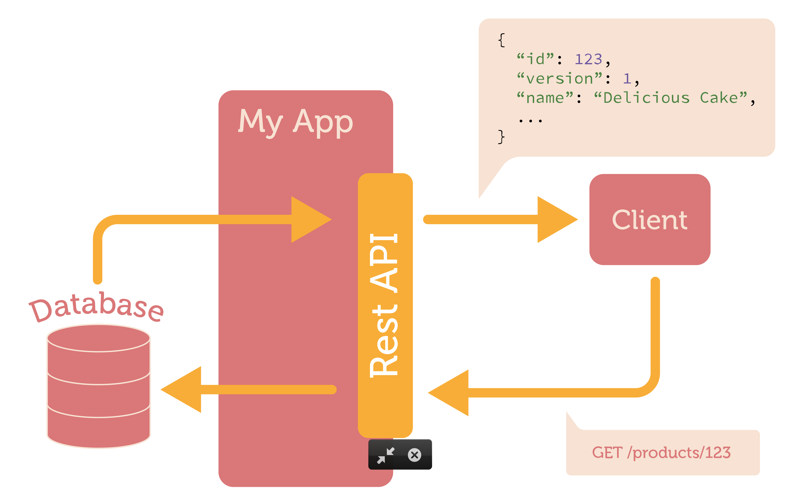
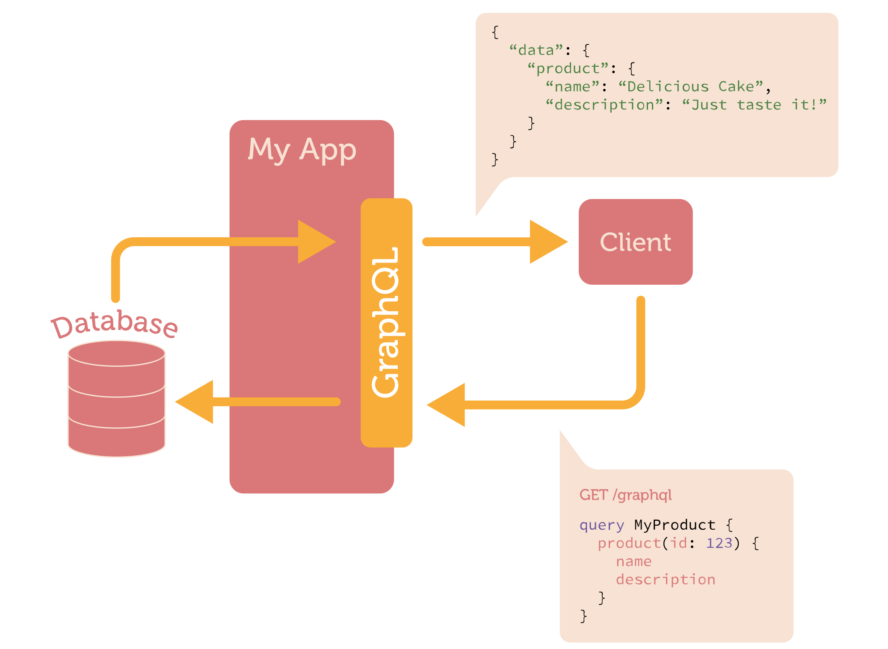

# [Fit] Better APIs
# [Fit] with GraphQL
## Josh Price
### github.com/joshprice
### @joshprice

^ Hi everyone, my name is Josh

^ It's great to be here. It's my first time at a DDD conference

^ Thanks for voting for my talk

^ I'm flattered!

---
# Agenda

- Understand GraphQL and why you'd use it
- Build a simple schema
- Run queries against the schema
- Understand important GraphQL concepts
- Summarise client options (Relay, Apollo)
- Gaze into the crystal ball

---
# Experience: GraphQL Elixir

- Motivation: Pain with REST APIs
- Mainly as a way to learn Elixir and GraphQL
- First major open source project
- I've learned a lot
- Lot's left to learn
- Implementing a GraphQL server is hard

^ Bit of background in case you're wondering "what does this guy know about GraphQL?"

^ Community driven Elixir GraphQL implementation

^ 404 stars (~22nd most popular elixir github repo) ~20 contributors

---
# REST APIs



^ We've probably all used a RESTful API before

^ Most of us have built at least one

---
# [Fit] REST is great

^ Simple,  (Mostly) well understood

^ APIs work like the web does

^ Lots of tooling

^ Designed for **very** loose coupling

^ URL based (easy to develop against/debug)

---
# [Fit] REST is *hard*

^ Big upfront design required

^ Hard to model certain domains

^ Hard to change (versioning problems)

^ Maintainability issues

^ No one true way to do REST (Swagger/OpenAPI)

---
# Cargo Cult?


^ Are we cargo culting REST?

^ WW2 Pacific Islands US forces brought a lot of planes and cargo

^ Cargo Cults still practice today in Tanna, Vanuatu

^ REST is a sensible default but we use REST without thinking about it

---
# Common Problems

## Overfetching 
## Underfetching

^ Need to anticipate all current and future clients and their needs

^ Badly designed APIs can significantly hamper the design of great frontends

^ N + 1 HTTP requests

---
# Internal APIs
# are tightly coupled
# to their clients

^ REST works well for loosely couple external APIs

^ Tightly coupled internal APIs don't work so well for REST

---
# GraphQL 



---
# What is GraphQL?

* Language for defining schemas, types & queries
* Developed by Facebook in 2012
* Used to improve mobile app performance
* Serves **300 billion+** requests per day

---
# Open Source

* Open sourced in **July 2015**
* Specification
  - **facebook.github.io/graphql**
* Reference Implementation
  - **github.com/graphql/graphql-js**
* Relay released in **August 2015**

---
# GraphQL Server Implementations

- JavaScript reference
- Ruby / Python / PHP
- Java / Scala (Sangria)
- .NET
- Elixir / Go / Haskell
- etc...

---
# GraphQL Misconceptions

* It's not really about "graphs"
* It's a *specification* for client/server interaction
* Language independent
* Assumes nothing about:
  - transport
  - message protocol
  - data store

---
# Exhibit A: REST API

Fetch user name and friends names

`GET /users/1`
`GET /users/1/friends`

or

`GET /users/1/friends?include=user.name,friend.name`

^ This is what GraphQL provides for you is a standard way of doing this

---
# Exhibit B: GraphQL API

```
{                                     "data": {
  user(id: 1) {                         "user": {
    name                                  "name": "Josh",
    friends(first: 1) {                   "friends": [{
      name                                  "name": "James"
    }                                     }]  
  }                                     }  
}                                     }
```

---
# Better
# Mental
# Model

^ Easy to write and reason about queries

^ Same shape as resulting data

^ Easy for client developers to understand

^ No impedance mismatch between view and server

---
# Strongly
# typed

^ code generation, ide tooling

^ validation of queries 

^ guarantee correct results

^ possibility for great tooling, flow/elm types

---
# Single
# Endpoint 

^ Simpler, no URL structure to remember

---
# Single
# Query

^ Fetch exactly the required data in one call 

---
# Unambiguous
# Queries

^ Queries must define all data requested ie every field

^ In REST as fields are added, old clients get bloated

^ Clients always get only needed data

---
# Consumer
# Driven
# Contracts

^ CDC came from SOAP/XML contracts

^ View reqts drive the API

^ APIs understand client usage through queries

^ Easier to evolve a service without versioning

---
# Less
# Versioning 

^ Problem with REST APIs is adding fields

^ Field additions bloat all existing clients

^ Versioning is required in REST 

^ Facebook still has 4 year old clients which work on the same version

---
# Self
# Documenting

^ Just add descriptions to types and fields

^ Deprecation and reason supported, helps evolve API

---
# Performance

^ Major bandwidth/latency reduction from overfetching and N+1 HTTP roundtrips

---
# Let's build our 
# first Schema

---
# Query and Mutation Roots

```capnp
type Query {
  me: User
  user(id: Int): User
}

type Mutation {
  createPost(title: String!): Post
  createComment(message: String!): Comment
}
```

---
# Object Types and Enums

```js
type User {
  name: String
  profilePicture(size: Int = 50): ProfilePicture
  friends(first: Int, orderBy: FriendOrder): [User]
  events(first: Int): [Event]
}

enum FriendOrder { FIRST_NAME, LAST_NAME, IMPORTANCE }
```

---
# More Types

```js
type ProfilePicture {
  width: Int
  height: Int
  url: String
}

type Event {
  name: String
  attendees(first: Int): [User]
}
```

---
# Simplest Query

```js
{                                                                
  me {                                                                
    name                                                                
  }                                                                
}                                                                
```


```js
{
  "data": {
    "name": "Josh Price"
  }
}
```

---
# Deeply Nested Query

```js
{                                      {                        
  me {                                   "data": {                             
    name                                   "name": "Josh Price",
    profilePicture {                       "profilePicture": {
      url                                    "url": "http://cdn/josh_50x50.png"
    }                                      },
    friends(first: 1) {                    "friends": [{
      name                                   "name": "James Sadler"
    }                                      }],
    events(first: 1) {                     "events": [{
      name                                   "name": "Afterparty!",
      attendees(first: 1) {                  "attendees": [{
        name                                   "name": "Jenny Savage"
      }                                      }]
    }                                      }]                          
  }                                      }                          
}                                      }                       
```

---
# User Type (IDL)

```js
type User {
  name: String
  profilePicture(size: Int = 50): ProfilePicture
  friends(first: Int, orderBy: FriendOrder): [User]
}
```

---
# User Type with JS Resolvers 

```js
new GraphQLObject({
  type: "User",
  fields: {
    name(user) {
      return user.name
    },
    profilePicture(user, {size}) {
      return getProfilePicForUser(user, size);
    },
    friends(user) {
      return user.friendIDs.map(id => getUser(id));
    }
  }
});
```

---
# Resolvers

- Your own functions
- Could use in memory data
- Call any data store
- Call REST APIs
- Call existing services
- GraphQL doesn't care
- Resolver "Middleware" (Auth, Logging, etc)

^ only guarantee is that resolvers are run if matched

^ Serverless

---
# Mutations Modify Data

```js
mutation {
  acceptFriendRequest(userId: 345124) {
    user {
      friends { count }
    }
  }
}
```

```js
mutation {
  rsvpToEvent(eventId: 134624, status: ATTENDING) {
    event {
      invitees { count }
      attendees { count }
    }
  }
}
```

^ Mutations call a function and return data that may have changed

---
# CQRS

^ Reads and writes are separate

^ Naturally supports Command / Query split

^ Separate code paths if you need it

---
# Setup GraphQL Express

```js
import { Schema } from './schema.js';
import graphqlHTTP from 'express-graphql';
import express from 'express';

const app = express();

app.get('/', function(req, res) {
  res.redirect('/graphql');
});

app.use('/graphql', graphqlHTTP({ schema: Schema, graphiql: true }));

app.listen(3000);
```

---
# GraphiQL
# Demo

^ Show docs

^ Show modifying queries

^ Autocomplete and error checking

---
# Queries with Fragments

```js
query {
  event(id: 123) {
    ...attendeeList
  }
}

fragment profilePic on User {
  profilePicture { width, height, url }
}

fragment personRow on User {
  ...profilePic
  name
}

fragment attendeeList on Event {
  attendees {
    ...personRow
  }
}
```

^ Composition and reuse

---
# View Components

```js
fragment profilePic on User {
  profilePicture {
    width
    height
    url
  }
}
```

```js
function ProfilePic(props) {
  const pic = props.data.profilePic
  return 
}
```

---
# Component Hierarchy

```js
fragment personRow on User {
  ...profilePic
  name
}
```

```js
function PersonRow(props) {
  const data = props.data
  return (
    <div>
      <ProfilePic data={data} />
      <span>{data.name}</span>
    </div>
  );
}
```

---
# Relay

- Each view component declares query
- Relay batches current render tree 
- Sends single query
- Handles caching using global IDs
- Relies on schema conventions for metadata

^ Don't have time to go into any detail

^ Same concept applies to all client side frameworks

---
# Client-Side Alternatives

- ApolloStack Client
  + React + Native
  + Angular 2
  + Redux support
- Lokka
  - Simple

---
# Gotchas

- Arbitrary Queries
  - Could be slow if deeply nested
  - Complexity analysis
  - Query depth
- Batching at resolver
- You can control this internally
- FB validates at dev time, query by ID

---
# When to use?

- Use for internal APIs
- Improve mobile (and desktop performance)
- Buildkite has exposed a small external API
- Be careful exposing this to the world!
- Don't allow arbitrary queries from unknown clients

---
# GraphQL Ecosystem
# Evolving Quickly

^ It's been a year and there was a flurry of activity

^ Many exciting tools are appearing and I can barely keep up

---
# GraphQL Backend as a Service

- reindex.io
- graph.cool
- scaphold.io

^ New in last ~3 months

^ Firebase, Parseapp closed system and didn't work

^ GraphQL is an open spec (cf Meteor pivoting)

---
# Future - GraphQL Spec

* Push: Apps should reflect current state of world
* Subscriptions + Reactive Backend + RethinkDB
* Defer 
* Stream
* Live queries
* GraphQL CATS

^ YAML specs for cross-implementation compatibility

^ Makes it easier to implement spec correctly

---
# Subscriptions

```js
subscription {
  createCommentSubscribe(storyId: $id) {
    comment {
      ...FBCommentFragment
    }
  }
}
```

^ In production at Facebook

^ Looks like a mutation

^ Subscribes to update topic in pub-sub backend

^ Kinda complicated but super exciting

^ Yanked from early version of spec

---
# Warning!
# **Experimental**

---
# Defer Directive

```js
{                                     { 
  feed {                                "feed": {
    stories {                             "stories": [{
      author { name }                       "author": { "name": "Lee Byron" },
      title                                 "title": "GraphQL is the Future"
      comments @defer {                   }, {
        author { name }                     "author": { "name": "Josh Price" },
        comment                             "title": "REST is old school"
      }                                   }]
    }                                   } 
  }                                   }  
}                                    
```

^ Allows rendering of all stories immediately

^ Comments come in the next request

---
# Defer - Comments arrive

```js
{                                  { 
  feed {                             "path": ["feed", "stories", 0, "comment"]
    stories {                        "data": [{
      author { name }                  "author": { "name": "Joe Bloggs" },
      title                            "comment": "That blew my mind!"
      comments @defer {              }, {
        author { name }                "author": { "name": "Jenny Savage" },
        comment                        "comment": "I love it"
      }                              }]
    }                              } 
  }                                  
}                                    
```

---
# Stream Directive

```js
{                                     { 
  feed {                                "feed": {
    stories @stream {                     "stories": []
      author { name }                   }
      title                           }
      comments @defer {               
        author { name }               
        comment                       
      }                               
    }                                 
  }                                   
}                                    
```

^ Streams each item in a list

^ HTTP/2

---
# Stream - First Story

```js
{                                  { 
  feed {                             "path": ["feed", "stories", 0]
    stories @stream {                "data": [{
      author { name }                  "author": { "name": "Joe Bloggs" },
      title                            "title": "That blew my mind!"
      comments @defer {              }]
        author { name }            }  
        comment                      
      }                              
    }                               
  }                                  
}                                    
```

^ Comments and further stories are patched in 

---
# Live Directive

```js
{                                     { 
  feed {                                "feed": {
    stories {                             "stories": [{
      author { name }                       "author": { "name": "Lee Byron" },
      title                                 "title": "GraphQL is the Future",
      likeCount @live                       "likeCount": 9
    }                                     }] 
  }                                     }
}                                     }
```

---
# Live - Likes update on backend

```js
{                                { 
  feed {                           "path": ["feed", "stories", 0, "likeCount"],
    stories {                      "data": 10
      author { name }            }
      title                      
      likeCount @live            
    }                            
  }                              
}                                
```

---
# Resources

* **graphql.org**
* Github
  * **graphql/graphql-js**
  * **graphql/express-graphql**
* Steve Luscher talk **Zero to GraphQL**
* Awesome GraphQL (**chentsulin/awesome-graphql**)

---
# Questions?

---
# Thanks!

