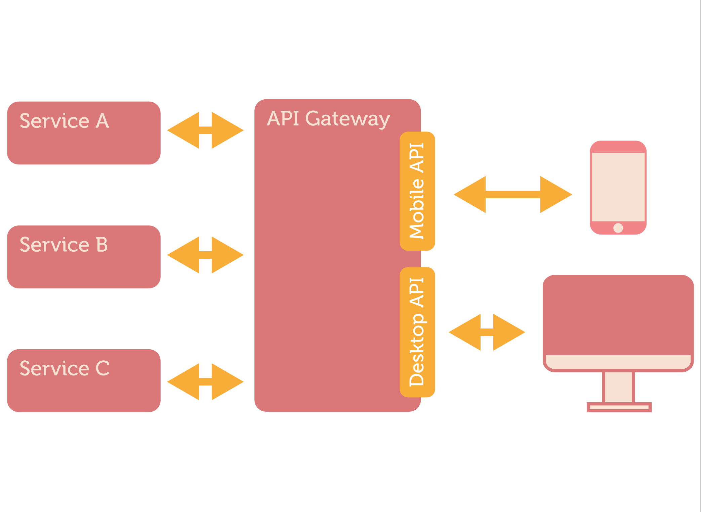

# [Fit] Better APIs
# [Fit] with GraphQL
## Josh Price
### github.com/joshprice
### @joshprice

---
# Agenda

- Understand GraphQL and why you'd use it
- Build a simple schema
- Run queries against the schema
- Understand important GraphQL concepts
- Summarise client options (Relay, Apollo)
- Understand BaaS options

---
# GraphQL Elixir

* Community driven Elixir GraphQL implementation
* 404 stars (~22nd most popular elixir github repo)
* ~20 contributors
* Me and @freshtonic

---
> The only way of discovering the limits of the possible is to venture a little way past them into the impossible
-- Clarke's Second Law

---
# Typical REST API


---
# [Fit] Internal APIs
# [Fit] tightly coupled
# [Fit] to clients

---
# [Fit] REST is great

^ Simple
^ (Mostly) well understood
^ APIs work like the web does
^ Lots of tooling
^ Designed for **very** loose coupling
^ URL based (easy to develop against/debug)

---
# [Fit] REST
# [Fit] is *hard*
# [Fit] in practice

^ Big upfront design required
^ Hard to get right
^ Hard to change (versioning problems)
^ Maintainability issues
^ No one true way to do REST (Swagger)

---
# [Fit] Overfetching 
# [Fit] Underfetching

^ Need to anticipate all current and future clients and their needs
^ Badly designed APIs can significantly hamper the design of great frontends

---
# What is GraphQL?

* Language for defining types & queries
* Developed by Facebook in 2012
* Used to improve mobile app performance
* Serves 300 billion requests per day

---
# GraphQL is Open Source

* Open source version published in July 2015
* Relay released in August 2015
* Specification: https://facebook.github.io/graphql

---
# Lots of implementions

- JavaScript reference
- Ruby
- Python
- Java / Scala
- Go
- Elixir
- ...

---
# GraphQL Highlights

* It's a *specification* for client/server interaction
* Language independent
* Assumes nothing about:
  - transport
  - message protocol
  - data store

---


---
# Exhibit A: REST API

Fetch user name and friends names

`GET /users/1`
`GET /users/1/friends`

or

`GET /users/1/friends?include=user.name,friend.name`

^ This is what GraphQL provides for you is a standard way of doing this

---
# Exhibit B: GraphQL API

```
{                                     "data": {
  user(id: 1) {                         "user": {
    name                                  "name": "Josh",
    friends(first: 2) {                     "friends": [{
      name                                  "name": "James"
    }                                     }]  
  }                                     }  
}                                     }
```

---
# Key
# features

---
# Strongly
# typed

---
# Single
# endpoint

---
# Single
# query

---
# Self documenting

---
# [fit] Performance

^ * Major bandwidth/latency reduction from overfetching and N+1 HTTP roundtrips

---

# [fit] Ecosystem
# [fit] Evolving
# [fit] Quickly

---
# Many Server Implementations

- Javascript (reference)
- Ruby/Python/PHP
- Java, Sangria (Scala), 
- .NET
- Elixir

---
# Client Frameworks

- Relay (React)
- ApolloStack Client
  + React + Native
  + Angular 2
  + Redux support
- Lokka

---
# Simple Schema

```elixir
type QueryRoot {
  greeting: String
}
```

---
# Simple Query

### Query

```js
{ greeting }
```

### JSON response

```js
{
  "data": {
    "greeting": "Hello, World!"
  }
}
```

---
# Schema with Data Fetching

```elixir
@items %{"a" => %{id: "a", name: "Foo"}, "b" => %{id: "b", name: "Bar"}}

%Schema{
  query: %ObjectType{
    fields: %{
      item: %{
        type: %Item{},
        args: %{id: %{type: %String{}}},
        resolve: fn(_, %{id: id}, _) -> Map.get(@items, id) end
      }
    }
  }
}
```

---
# Query

```js
{
  item(id: "a") {
    id
    name
  }
}
```

---
# JSON Response

```js
{
  "data": {
    "id": "a",
    "name": "Foo"
  }
}
```

---
# Setup GraphQL Express

```js
import { Schema } from './schema.js';
import graphqlHTTP from 'express-graphql';
import express from 'express';

const app = express();

app.get('/', function(req, res) {
  res.redirect('/graphql');
});

app.use('/graphql', graphqlHTTP({ schema: Schema, graphiql: true }));

app.listen(3000);
```

---
# [fit] GraphiQL
# [fit] Demo

---
# GraphQL Shim

* Wrap a REST API by calling  

---
# GraphQL CATS

- Compatibility Acceptance Tests
- YAML specs for cross-implementation compatibility

# Demo

---
# Arbitrary Queries

- 

---
# When to use?

- Don't allow arbitrary queries from unknown clients
- Use when you have 

---
# Early Days

- 


---
# GraphQL Backend as a Service

- Reindex
- Graph.cool
- 

---
# Future - GraphQL Spec

* Push: Apps should reflect current state of world
* Subscriptions + Phoenix channels + RethinkDB
* Defer 
* Stream
* Live queries

---
# Resources

* Website
  - http://graphql-elixir.org
* Plug (Hex: plug_graphql)
  - https://github.com/graphql-elixir/plug_graphql
* Examples
  - https://github.com/graphql-elixir/hello_phoenix_graphql


---
# Questions?

---


