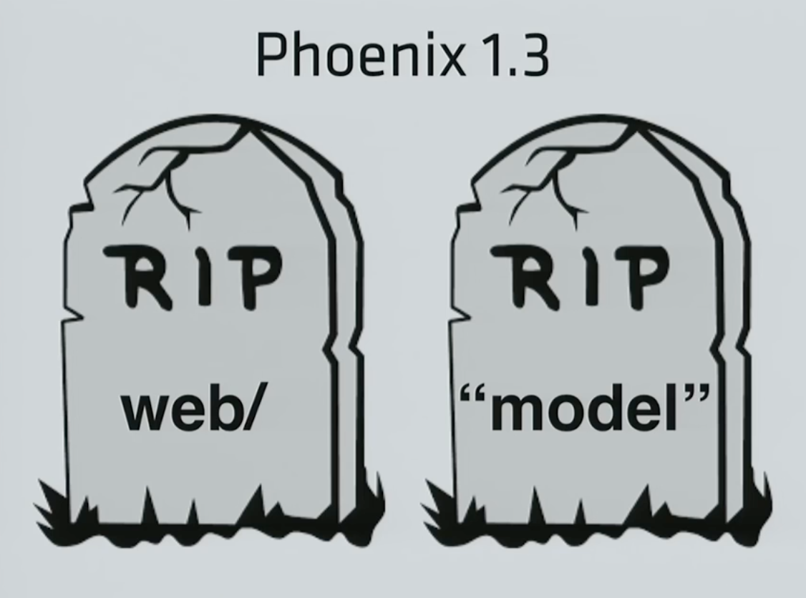
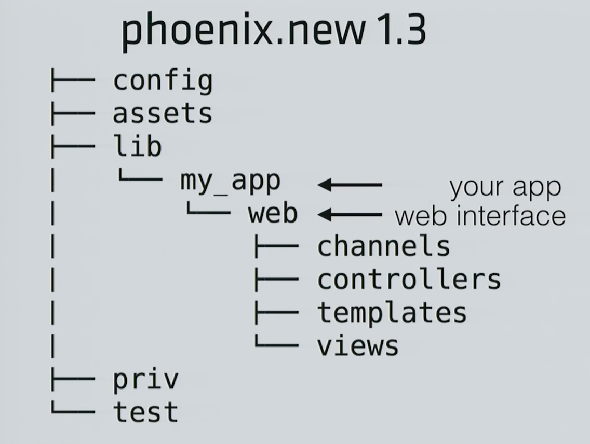

# Phoenix 1.3
## Past, Present and Future
## @joshprice

---
# Survey

- Who has used Phoenix before?
- Who has a Phoenix app in production?
- Who has played around with 1.3-rc?

---
# Phoenix

- Elixir Web Framework
- Based entirely on Plug:
  eg `Controller`, `Action`, `Router`, `Endpoint`
- Gains most of it's flexibility from `Plug`
- Phoenix web apps are `Plug`s themselves
- Mostly a bunch of convenience macros over `Plug`

---
# Why is Phoenix so AWESOME?

- Ridiculously fast
- Simple
- Robust
- Embraces and extends `Plug`
- Familiar to Rails Refugee

---
# aka "Rails the Good Parts"

---
# What is a `Plug`?

---
# Quick Plug Review

Plugs are simple:

- Takes a `Plug.Conn` as `conn`
- (maybe) Transform the `conn` or do something "side-effecty"
- Returns a new `Plug.Conn`

---
# Function Plug Example

```elixir
def hello_world_plug(conn, _opts) do
  conn
  |> put_status(:ok)
  |> send_resp("Hello World!")
end
```

```elixir
def json_header_plug(conn, _opts) do
  conn
  |> put_resp_content_type("application/json")
end
```

---
# Hello World Module Plug Example

```elixir
defmodule HelloWorldPlug do
  def init(opts) do
    opts
  end

  def call(conn, _opts) do
    conn
    |> put_status(:ok)
    |> send_resp("Hello World!")
  end
end
```

---
# JSON Header Module Plug Example

```elixir
defmodule JSONHeaderPlug do
  def init(opts) do
    opts
  end

  def call(conn, _opts) do
    conn
    |> put_resp_content_type("application/json")
  end
end
```

---
```elixir
defmodule MyPlugPipeline do
  use Plug.Builder

  plug Plug.Logger
  plug :hello, upper: true

  # A function from another module can be used as a plug
  import AnotherModule, only: [interesting_plug: 2]
  plug :interesting_plug

  def hello(conn, opts) do
    body = if opts[:upper], do: "WORLD", else: "world"
    send_resp(conn, 200, body)
  end
end
```

^ Pipeline with Plug.Builder

---
# Anatomy of a Phoenix Application

---
# Endpoint

```elixir
defmodule ElixirSydney.Web.Endpoint do
  use Phoenix.Endpoint, otp_app: :elixir_sydney

  # Serve at "/" the static files from "priv/static" directory.
  plug Plug.Static,
    at: "/", from: :elixir_sydney, gzip: false,
    only: ~w(css fonts images js favicon.ico robots.txt)

  plug Plug.Logger

  plug Plug.Parsers,
    parsers: [:urlencoded, :multipart, :json],
    pass: ["*/*"],
    json_decoder: Poison

  plug ElixirSydney.Web.Router
end
```

---
# Router

```elixir
defmodule ElixirSydney.Web.Router do
  use ElixirSydney.Web, :router

  pipeline :browser do
    plug :accepts, ["html"]
  end

  scope "/", ElixirSydney.Web do
    pipe_through :browser # Use the default browser stack

    get "/", PageController, :index
    get "/meetups", PageController, :meetups
    get "/meetup/:slug", PageController, :meetup, param: "slug"
  end
end
```

---
# Controller

```elixir
defmodule ElixirSydney.Web.PageController do
  use ElixirSydney.Web, :controller
  alias ElixirSydney.Meetup

  def index(conn, _params) do
    render conn, "index.html", meetup: Meetup.next_meetup
  end

  def about(conn, _params) do
    render conn, "about.html"
  end
end
```

---
# Layout (app.html.eex)

```html
<!DOCTYPE html>
<html lang="en">
  <head>
    <title>Elixir Sydney</title>
    <link rel="stylesheet" href="<%= static_path(@conn, "/css/app.css") %>">
  </head>
  <body class="sitesection-<%= @page_name %>">
    <%= render "_header.html", assigns %>

    <main role="main" class="site-body">
      <%= render @view_module, @view_template, assigns %>
    </main>

    <%= render "_footer.html", assigns %>
    <script src="<%= static_path(@conn, "/js/app.js") %>"></script>
  </body>
</html>
```

---
# View Template (templates/page/meetup.html.eex)

```html
<div>
  <%= render "_meetup.html", meetup: @meetup, past: true %>
</div>
```

---
# What's New in Phoenix 1.3?

- Moving `/web` inside `/lib` (no special directories)
- New `Web` namespace convention "reinforces" Phoenix related web modules are the web interface to your app
- New `phx.gen.html` and `phx.html.json` generators
- **Contexts** help isolate your web interface from your domain

---
# Key messages

- Phoenix is just the web presentation layer of your application
- Your application should exist independently of the web layer
- New changes in 1.3 reinforce this message more clearly

---


---
# Phoenix is not your application

---
# `mix phoenix.new` (1.2)

```
demo12
├── node_modules
├── lib
│   └── demo12
├── priv
│   └── static
├── test
└── web
    ├── channels
    ├── controllers
    ├── models
    ├── static
    ├── templates
    └── views
```

---
# `mix phx.new` (1.3)

```
demo13
├── assets
│   ├── node_modules
│   └── static
├── lib
│   └── demo13
│       ├── application.ex
│       ├── repo.ex
│       └── web
│           ├── channels
│           ├── controllers
│           ├── templates
│           └── views
├── priv
│   └── static
└── test
    └── web
```

---


---
# `mix phoenix.*` commands (1.2)

```
mix phoenix.digest       # Digests and compress static files
mix phoenix.gen.channel  # Generates a Phoenix channel
mix phoenix.gen.html     # Generate controller, model, views for HTML resource
mix phoenix.gen.json     # Generate controller, model for JSON resource
mix phoenix.gen.model    # Generates an Ecto model
mix phoenix.gen.presence # Generates a Presence tracker
mix phoenix.gen.secret   # Generates a secret
mix phoenix.new          # Creates a new Phoenix v1.3.0-rc.1 application
mix phoenix.routes       # Prints all routes
mix phoenix.server       # Starts applications and their servers
```

---
# New `mix phx.*` commands (1.3)

All the previous mix commands plus:

```
mix local.phx          # Updates the Phoenix project generator locally
mix phx.gen.context    # Generate context with functions around an Ecto schema
mix phx.gen.schema     # Generates an Ecto schema and migration file
mix phx.digest.clean   # Removes old versions of static assets.
```

---
# Contexts

## Better Design Decisions

---


---
# What is a context?

- `phx.gen.html|json` generate code inside a Context
- Just a well-named module, with well-named functions
- Represents an API boundary to part of your application domain
- aka DDD Bounded Context

---
# Context Generation Example

For example, to generate a "user" resource we'd run:

    mix phx.gen.html Accounts User users email:string:unique

or on our Elixir Sydney website:

    mix phx.gen.html Blog Post posts title:string body:string

---
# Why Contexts?

- For small apps, your app is basically the context
- You still need an API around your domain model though
- You may only use one context in a very small app
- For big apps this breaks up your app/domain into different modules/apps
- Stops you from making a giant monolith (aka Big Ball of Mud)
- Inevitably small apps get bigger, so makes it easy to grow

---
# Fallback controller

---
```elixir
def create(conn, %{"user" => user_params}) do  
  user = Repo.get_by(User, phone_number: user_params["phone_number"])

  cond do
    user && checkpw(user_params["password"], user.password_hash) ->
      case create_session(user) do
        {:ok, session} ->
          conn
            |> put_status(:created)
            |> render("show.json", %{session: session, user: user})

        _ ->
          conn
            |> put_status(:unauthorized)
            |> render("error.json")
      end

    true ->
      dummy_checkpw()
      conn
        |> put_status(:unauthorized)
        |> render("error.json")
  end
end  
```

^ Error scenarios in controller

---
# With 1.3 `action_fallback`

```elixir
action_fallback MyApp.Web.FallbackController

def create(conn, %{"user" => user_params}) do  
  user = Accounts.get_user_by_phone(user_params["phone_number"])

  cond do
    user && checkpw(user_params["password"], user.hashed_password) ->
      with {:ok, %Session{} = session} <- Sessions.create_session(user) do
        conn
        |> put_status(:created)
        |> render("auth_success.json", user: user, session: session)
      end

    true ->
      {:error, :wrong_credentials}
  end
end  
```

---
```elixir
defmodule MyApp.Web.FallbackController do  
  use MyApp.Web, :controller

  def call(conn, {:error, %Ecto.Changeset{} = changeset}) do
    conn
    |> put_status(:unprocessable_entity)
    |> render(MyApp.Web.ChangesetView, "error.json", changeset: changeset)
  end

  def call(conn, {:error, :unauthorized}) do
    conn
    |> put_status(:unauthorized)
    |> render(MyApp.Web.ErrorView, "auth_required.json")
  end

  def call(conn, {:error, :wrong_credentials}) do
    conn
    |> put_status(:unprocessable_entity)
    |> render(MyApp.Web.ErrorView, "wrong_credentials.json")
  end
end
```

---
# Centralised Error Responses

`ErrorView` module becomes centralized list of error scenarios

---
# Default Responses for your Actions

```elixir
def delete(conn, _params) do  
  with {:ok, session} <- Authentication.get_session(conn),
       {:ok, deleted} <- Sessions.delete_session(session) do
    :success
  else _ ->
    {:error, :unauthorized}
  end
end  
```

- `:success` will be passed to the appropriate action on your fallback controller
- eg 201 Accepted

---
# Other new features

- Add `current_path` and `current_url` functions to generate a connection's path and url

---
# WARNING

## Still Release Candidate (1.3-rc.1)

## Upgrade at your own risk

## Things might change

---
# Upgrading

- Upgrade Guide
https://gist.github.com/chrismccord/71ab10d433c98b714b75c886eff17357

- Simple
- Nothing breaks (as far as I've found)
- Needs some migration to new structure (see Guide)
- But this will improve your architecture dramatically!

---
# Resources

- Chris McCord's Lonestar Elixir talk
 https://www.youtube.com/watch?v=tMO28ar0lW8

- Release announcement https://elixirforum.com/t/phoenix-v1-3-0-rc-0-released/3947

- DDD Bounded Context https://martinfowler.com/bliki/BoundedContext.html

---
# Thanks!

## Questions?
